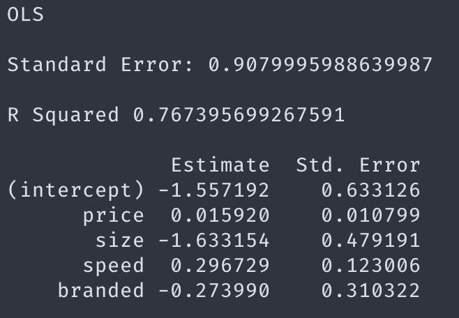
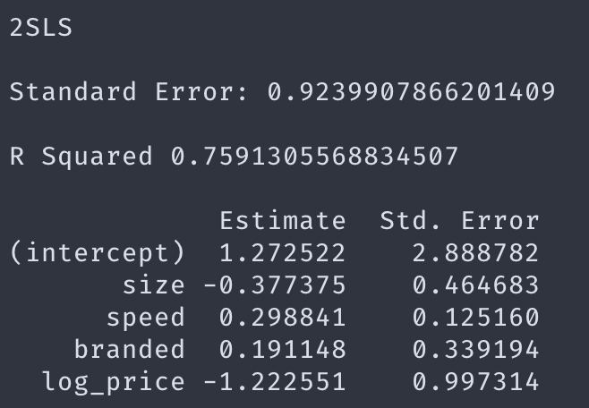
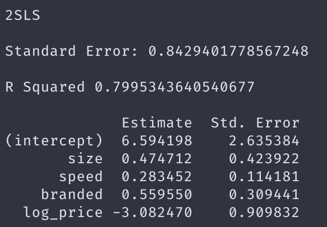

# Problem Set 1

## Empirical Industrial Organisation

###### Instituto Tecnológico Autónomo de México

###### Carlos Lezama

### The Data

The dataset contains (fictitious) individual level purchase data from an online trading site for memory chips. There are 48 possible combinations for a chip, and one seller for each type who may change its price over time. The data show the characteristics of each type of chip when the customer visits, including a variable that indicates if the chip was available.

The following is the description of the variables in the dataset.

- `visitid`: an ID number that indicates the visit of a particular customer (e.g. Horca Andy visiting at 11:01pm) — for each visit there are a series of rows, one for each of the product types available when the visit occurred
- `size`: chip memory storage (values from 1 to 6 representing categorical values for sizes such as 512 MB, 16 GB)
- `speed`: chip speed rated from 1 to 4
- `branded`: branded or generic dummy variable
- `price`: sale price
- `outofstock`: availability dummy variable
- `wholecost`: seller's wholesale cost
- `choice`: indicator of whether the visitor bought the product (suppose he can only buy one unit) — if no product is purchased, then the consumer chooses the outside good

### Aggregate Data

We are interested in the following preferences model:

$$
U_{ij} = \beta_1 p_j + \beta'_2 X\_j + \xi_j + \varepsilon_{ij}
$$

where the subscripts $i$ and $j$ refer to customer $i$ and product $j$ The variable $p_j$ denotes the product price logarithm. The vector $X_j$ groups exogenous characteristics that include `size`, `speed`, `branded`. As usual, $\xi_j$ captures unobserved characteristics of the product $j$ that are relevant for the customer’s decision. Finally, $\varepsilon_{ij}$ is an idiosyncratic Type 1 Extreme Value Error term. The utility of buying the outside good is $\varepsilon_{i0}$.

From our simulated data, we obtained the following market shares:

| Product | Share  |
| :-----: | :----: |
|    0    | 31.39% |
|   110   | 4.75%  |
|   111   | 1.65%  |
|   120   | 10.71% |
|   121   | 4.51%  |
|   130   | 7.83%  |
|   131   | 2.68%  |
|   140   | 17.25% |
|   141   | 7.20%  |
|   210   | 0.51%  |
|   211   | 0.28%  |
|   220   | 1.42%  |
|   221   | 0.96%  |
|   230   | 0.58%  |
|   231   | 0.39%  |
|   240   | 1.35%  |
|   241   | 1.16%  |
|   310   | 0.13%  |
|   311   | 0.06%  |
|   320   | 0.14%  |
|   321   | 0.15%  |
|   330   | 0.09%  |
|   331   | 0.12%  |
|   340   | 0.20%  |
|   341   | 0.28%  |
|   410   | 0.10%  |
|   411   | 0.17%  |
|   420   | 0.34%  |
|   421   | 0.41%  |
|   430   | 0.21%  |
|   431   | 0.25%  |
|   440   | 0.40%  |
|   441   | 0.74%  |
|   510   | 0.03%  |
|   511   | 0.10%  |
|   520   | 0.10%  |
|   521   | 0.40%  |
|   530   | 0.08%  |
|   531   | 0.15%  |
|   540   | 0.21%  |
|   541   | 0.43%  |
|   620   | 0.02%  |
|   621   | 0.01%  |
|   631   | 0.02%  |
|   640   | 0.02%  |
|   641   | 0.02%  |

where product 0 stands for the outside good and the rest are build-up identifiers constructed as follows: `product_id = str(size) + str(speed) + str(branded)`.

Furthermore, common regression analysis using OLS and 2SLS return results below.



$$
\log(s_k) - \log(s_0) \approx \alpha + \beta'X_j
$$

where $X$ considers `price`, `size`, `speed` and `branded` as regressors.



Here, the model intruments `log_price` with `wholecost` such that $X$ considers `size`, `speed`, `branded` and `log_price` as explanatory variables, and $Z$ considers `size`, `speed`, `branded` and `wholecost`. This way, we may note that `size`, `speed` and `branded` are considered exogenous variables, whereas `log_price` and `wholecost` stand for endogenous and instrumental variables, respectively.



For scale consistency, we tested whether the model prediction improved switching `wholecost` with `log_wholecost` or not, and so it did as we may observe with $s.e.$ reduction and greater $R^2$ coefficient.

Furthermore, we may observe that even though the $s.e.$ of the model slightly improved, the behavior is not determinant with any of these models since directions drastically change and so does the performance of each estimate. Nevertheless, price elasticity is intuitively better explained in 2SLS models. Finally, intercept’s standard error increases in such models tell us that logarithmic transformations may not lead us to the best fit possible, probably underperforming in prediction.

### Individual Level Data

We are interested in the following preferences model:

$$
U_{ij} = \beta_1 p_j + \beta'_2 X_j + \varepsilon_{ij}.
$$

Note that we have abstracted from the existence of any unobserved product characteristic, $\xi_{j}$. Additionally, observe that, with individual level data, $X_{jt}$ is 1 everywhere, except for the outside good, where it is 0.

We will estimate this model by maximum likelihood using multiple optimization routines. Furthermore, we want to estimate each estimator's performance.

Following the idea of minimizing simplex edges length in selected points over a surfaces, we coded Nelder-Mead method as follows:

```python
def nelder_mead(f, x_start,
                step=0.1, no_improve_thr=10e-6,
                no_improv_break=10, max_iter=0,
                alpha=1., gamma=2., rho=-0.5, sigma=0.5):

    # init
    dim = len(x_start)
    prev_best = f(x_start)
    no_improv = 0
    res = [[x_start, prev_best]]

    for i in range(dim):
        x = copy.copy(x_start)
        x[i] = x[i] + step
        score = f(x)
        res.append([x, score])

    # simplex iter
    iters = 0
    while 1:
        # order
        res.sort(key=lambda x: x[1])
        best = res[0][1]

        # break after max_iter
        if max_iter and iters >= max_iter:
            return res[0]
        iters += 1

        # break after no_improv_break iterations with no improvement
        print('...best so far:', best)

        if best < prev_best - no_improve_thr:
            no_improv = 0
            prev_best = best
        else:
            no_improv += 1

        if no_improv >= no_improv_break:
            return res[0]

        # centroid
        x0 = [0.] * dim
        for tup in res[:-1]:
            for i, c in enumerate(tup[0]):
                x0[i] += c / (len(res)-1)

        # reflection
        xr = x0 + alpha*(x0 - res[-1][0])
        rscore = f(xr)
        if res[0][1] <= rscore < res[-2][1]:
            del res[-1]
            res.append([xr, rscore])
            continue

        # expansion
        if rscore < res[0][1]:
            xe = x0 + gamma*(x0 - res[-1][0])
            escore = f(xe)
            if escore < rscore:
                del res[-1]
                res.append([xe, escore])
                continue
            else:
                del res[-1]
                res.append([xr, rscore])
                continue

        # contraction
        xc = x0 + rho*(x0 - res[-1][0])
        cscore = f(xc)
        if cscore < res[-1][1]:
            del res[-1]
            res.append([xc, cscore])
            continue

        # reduction
        x1 = res[0][0]
        nres = []
        for tup in res:
            redx = x1 + sigma*(tup[0] - x1)
            score = f(redx)
            nres.append([redx, score])
        res = nres
```

This algorithm would be used to find the maximum of the likelihood function described bellow:
$$
\ell(\cdot) = \sum_i \sum_j y_{ij}(\beta' X_{ij}) - \sum_i \sum_j y_{ij} \log \left( \sum_k \exp (\beta' X_{ik}) \right)
$$
Nevertheless, due to power constraints, the maximum was not achieved, although the algorithm was successfully tested with many other functions.

Formally, we may wanted to reach calculations close to our corresponding analytical gradient and Hessian:
$$
\nabla \ell = x_{ij}(\sigma(z_{ij}) - y_{ij})
$$

$$
\nabla^2 \ell = x_{ij} x'_{ij} \sigma(z_{ij}) (1 - \sigma(z_{ij}))
$$

where $z_{ij} = \beta'x_{ij}$ and $\sigma(\cdot)$ stands for the sigmoid function.