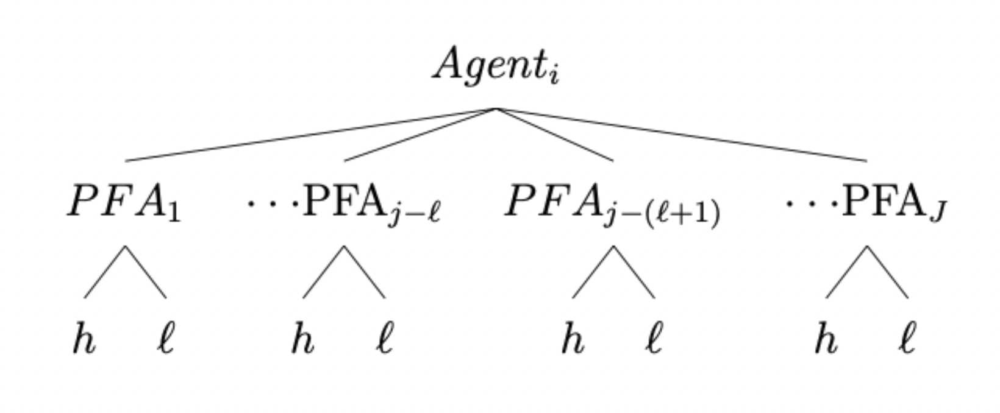

# Problem Set 1

## Empirical Industrial Organization

###### Instituto Tecnológico Autónomo de México

###### Carlos Lezama

This exam is inspired by Luco (2019). Individuals in their working age make savings decisions for retirement. We approach the worker's decision problem in a static manner, i.e., the worker makes a one-time decision.

### One Level Decision

The worker must choose one of $J$ pension fund administrators (PFA) to manage her retirement savings. The worker is mandated to save $10\%$ of her salary, $y_i$. Each PFA charges a percentage fee, $p_j$, over the worker's salary. PFAs differ in their return on investment, $R_j$. Finally, $\varepsilon_{ij}$ is an i.i.d. Type I Extreme Value preference shock. With all this in hand, we can write down the indirect utility that worker $i$ obtains from enrolling in PFA $j$ as

$$
u_{ij} = \alpha_i\left( y_i - 0.1y_i - p_jy_i \right) + \beta_iR_j + \varepsilon_{ij} ,
$$

where $\alpha_i$ and $\beta_i$ denote random coefficients. Moreover, let $\gamma_i = \left( \alpha_{i}, \beta_{i} \right)$, and $\gamma = \left( \alpha,\beta \right)$. We assume,

$$
\gamma_i = \gamma + \Gamma D_i + \nu_i ,
$$

where $D_i$ is a $d\times1$ vector of demographic variables, $\Gamma$ is a $2\times d$ matrix of coefficients that measure how taste varies with demographics, and $\nu_i$ is a $2\times1$ vector of unobserved individual characteristics determining taste, where $\nu_i \sim F_\nu(\cdot)$, with $F_\nu(\cdot)$ a distribution function.

Following Train (2009, 3.1), we can write the probability that worker $i$ chooses PFA $j$, $s_{ij}$, as follows:

$$
\begin{align}
s_{ij} &= P(u_{ij} \geq u_{ik},\ \forall j \neq k) \\
&= P(\varepsilon_{ij} - \varepsilon_{ik} \geq \gamma_{ik} - \gamma_{ij}) \\
&= \frac{\exp(\gamma_{ij})}{\displaystyle \sum_{j \in J} \exp(\gamma_{ik})}
\end{align}
$$

where $\gamma_{ij} = \beta_i R_j - \alpha_i p_j y_i$.

Additionally, we can express the price elasticity of the demand for PFA $j$, $E_{j, p_j}$, and the cross return elasticity of the demand for PFA $j$ with respect to the return of PFA $k$ (with $j \neq k$), $E_{j, R_k}$, like so

$$
\begin{align}
E_{j, p_j} &= \frac{\partial s_{ij}}{\partial p_j} \cdot \frac{p_j}{s_{ij}} \\
&= \frac{\partial \gamma_{ij}}{\partial p_j} p_j (1 - s_{ij}) \\
&= - \alpha_i p_j y_i (1 - s_{ij}) \\ \\
E_{j, R_k} &= \frac{\partial s_{ij}}{\partial R_k} \cdot \frac{R_k}{s_{ij}} \\
&= - \frac{\gamma_{ik}}{R_k} R_k s_{ik} \\
&= - \beta_i R_k s_{ik}
\end{align}
$$

as derived in Train (2009, 3.6).

Subsequently, with this setup, we can describe the log-likelihood of the model, $\mathcal{L} (\cdot)$, such that

$$
\begin{align}
\mathcal{L} (\cdot) &= \sum_i \sum_j \mathbf{1}_{ij} \log (s_{ij}) \\
&= \sum_i \sum_j \left( \frac{\exp(\gamma_{ij})}{\displaystyle \sum_{j \in J} \exp(\gamma_{ik})} \right).
\end{align}
$$

### Two Level Decision

Now, suppose that each PFA offers two portfolios that workers can choose where to invest their savings in: a high-return, high-risk portfolio, $h$; and low-return, low-risk portfolio, $l$.

We model the worker's choice of PFA and portfolio as a sequential decision, where individuals first choose the PFA, and then, conditional on the PFA, they choose the portfolio. The following diagram depicts the sequential two-level decision of the worker,

In this context, we model the indirect utility of choosing PFA $j=1,\dots,J$ and portfolio $g=h,l$ as,

$$
u_{ijg} = \alpha\left( y_i - 0.1y_i - p_jy_i \right) + \beta R_{jg} + \theta 
C_{jg} + \varepsilon_{ijg} ,
$$

where now, for simplicity, $\alpha$ and $\beta$ are not random but homogeneous coefficients across individuals. The variable $R_{jg}$ denotes the return of portfolio $g$ in PFA $j$ and, similarly, $C_{jg}$ denotes the risk of portfolio $g$ in PFA $j$. Finally, $\varepsilon_{ijg}$ is an i.i.d. GEV preference shock such that the model is a two-level nested logit.
